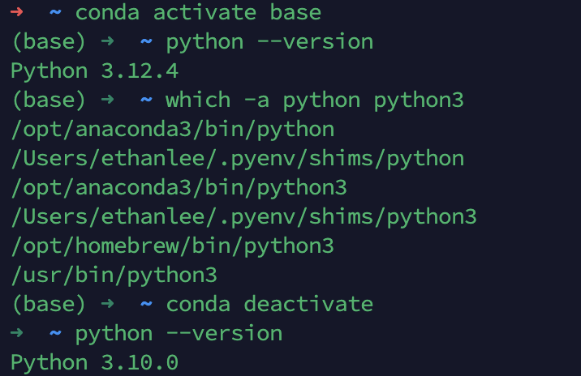

## What was covered today, 1/30

### Some Python review, see attached .ipynb file

Virtual environments will be covered in [Chapter 3](https://junwei-lu.github.io/bst236/chapter_workflow/) in the course notes. They are very important to use prior to installing Python packages

### Comments on the installation

- pyenv is the perferred way to download particular versions of python

- After running ```brew install pyenv```, you can add the following to the ```~/.zshrc```

    ```sh
    export PYENV_ROOT="$HOME/.pyenv"
    export PATH="$PYENV_ROOT/bin:$PATH"
    eval "$(pyenv init -)"
    ```

- But do make sure that the lines were successfully added by running ```cat ~/.zshrc```, which displays the entire file for your viewing


- If even after you ran 
    ```sh
    pyenv install 3.10.0
    pyenv global 3.10.0
    ```
    and the Python version is still not 3.10.0, here are some tips

    - First, check which version you are running

        When I run
        ```sh
        which -a python python3
        ```


        I see the following output:
        
        ```sh
            /Users/ethanlee/.pyenv/shims/python
            /Users/ethanlee/.pyenv/shims/python3
            /opt/homebrew/bin/python3
            /usr/bin/python3
        ```
        meaning that my shell will use the correct pyenv executable that was outlined in the instructions

        - For you, if the first output listed is ```~/.pyenv/shims/python```, then pyenv is in control
            - Set the desired Pythonversion globally ```pyenv global 3.10.0```
        - It could also show for Conda users something that resembles ```/opt/anaconda3/...``` or for others, ```/usr/bin/python3```
            - Your prompt upon opening a fresh terminal window might have ```(base)``` in front of the home directory
            - If so, you've probably used anaconda. Just disable the base conda environment ```conda deactivate``` and see if the python version is fixed. 

You can see here  


Upon deactivating the base conda environment, `python` switches back to the global version I set with pyenv.

`python` and `python3` are executable commands you can use to run Python, e.g. `python helloworld.py` or `python3 helloworld.py`.

To see which executable your shell will use, run:
```sh
which -a python python3
```
### Comments on VS Code Installations

- What is radian? You can think of radian as a fancy REPL. It adds to the regular R console some nicer aesthetic features. 
- Radian is a Python package
- After pip install radian, see if it installed correctly by running ```radian --version```
- If ```radian --version``` does not work, i.e. radian is not recognized, try ```pyenv radian --version```
- Open up your ```settings.json``` file inside VS Code and paste the path for radian inside, like this ```"r.rterm.mac": "/Users/ethanlee/.pyenv/versions/3.10.0/bin/radian"```
- See if it works, open up an R file inside VS Code, open your command pallete and try to open ```R: Create R terminal```. If that works, you should see the radian headers ```r$``` instead of the usual ```>```

- We recognize that the packge ```httpgd``` no longer supported. For now, it is not required,  it was just a package meant for viewing plots. It is not necessary for any assignments or for running R in VS Code in general. 


